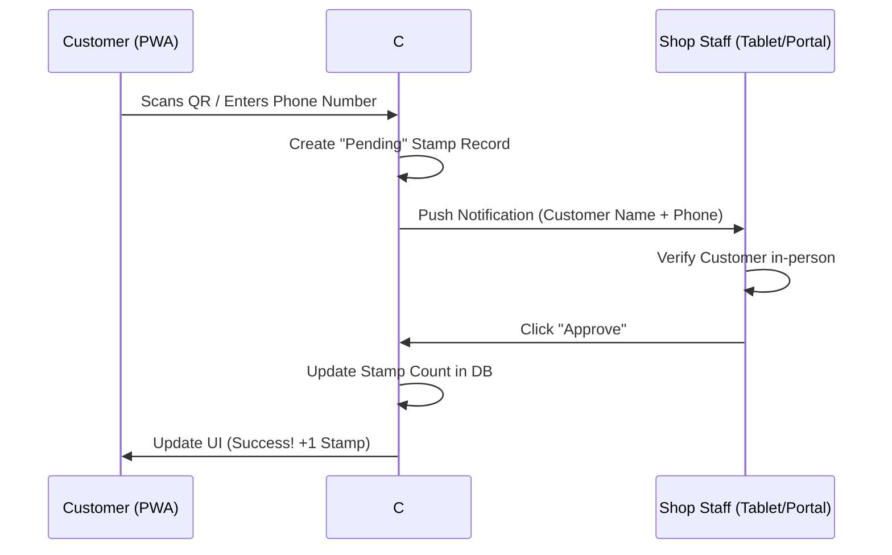

# 🧩 Odelagi Loyalty System – Frontend Roadmap

## Phase 1: The Core Stamp Engine (MVP)
**Focus:** Proving the *"Scan & Approve"* concept for a single shop.

### Services
- **React PWA**
  - Customer view: **Scan QR**
  - Staff view: **Approval List**
  - Authentication flow mapping to backend mock OTP.

## Phase 2: Multitenancy & Subdomains
**Focus:** Implement SaaS architecture with isolated tenant portals.

### Services
- Subdomain routing/awareness (e.g., matching UI branding based on tenant configuration).
- Rendering unique dynamic QR codes generated by the backend.

## Phase 3: The Communication & Marketing Layer
**Focus:** Customer engagement via WhatsApp and real-time updates.

### Services
- **Real-time Notifications**: WebSocket / SignalR client integration so the Staff portal updates instantly when a QR is scanned.

## Phase 4: Monetization & Scaling
**Focus:** Plan enforcement and platform expansion.

### Services
- **Customer Portal**: `customer.odelagi.com`
  - Users can view: Loyalty cards, Stamps across all shops.

---

## The "Scan to Approval" Workflow Diagram
This diagram helps you visualize the real-time interaction between the customer PWA and the staff portal

